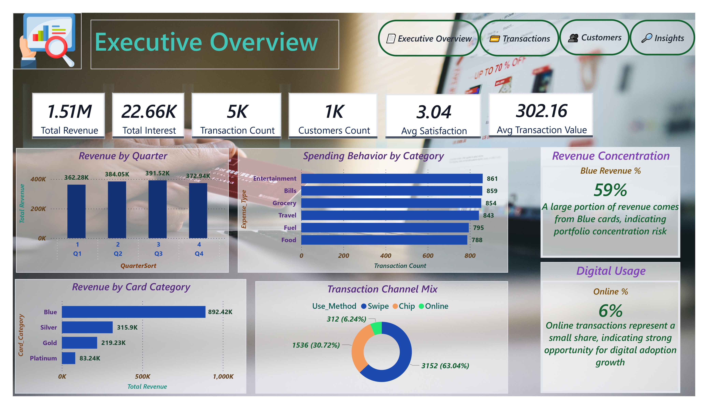
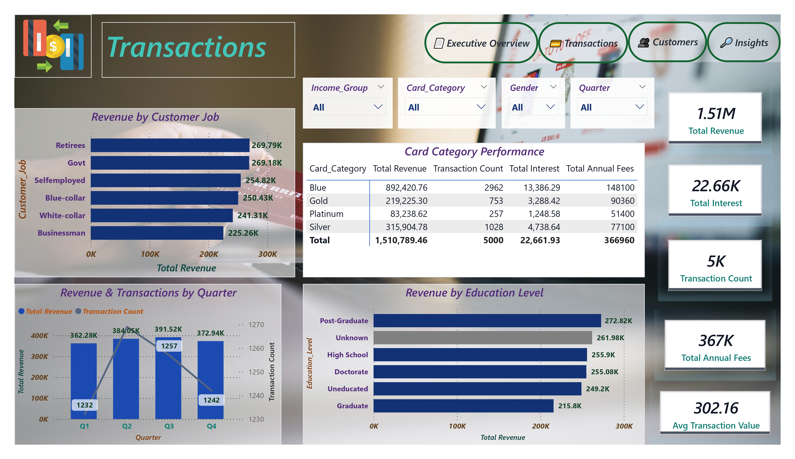
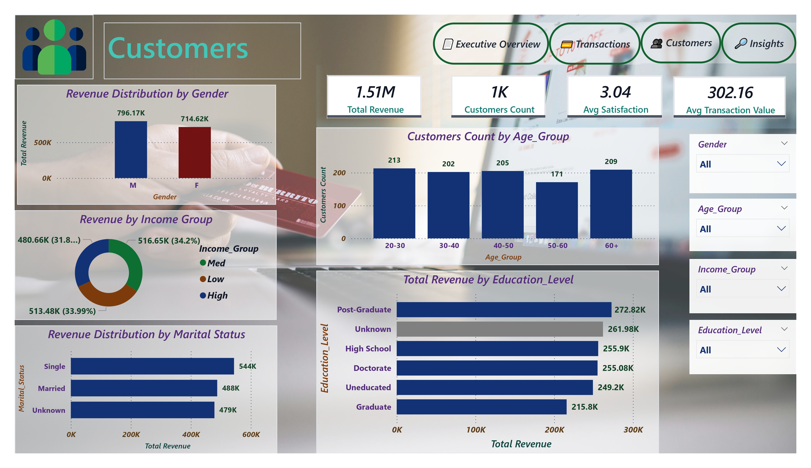
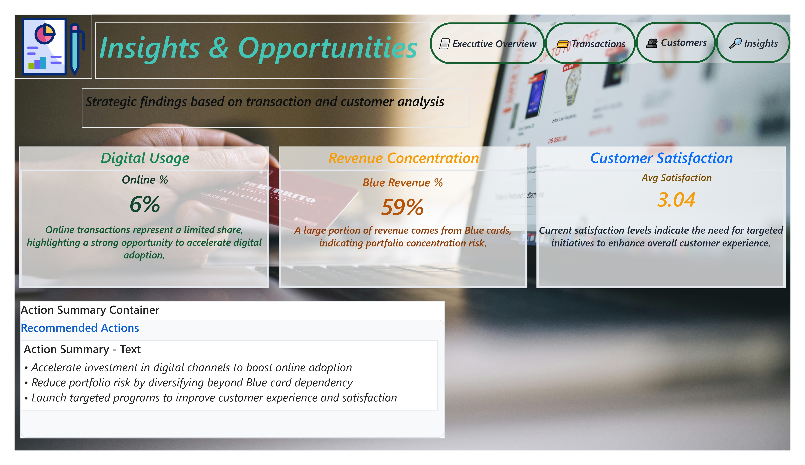

# Executive Credit Card Performance Dashboard

## Overview
An executive-level Power BI dashboard providing comprehensive insights into credit card performance, customer spending behavior, and transaction trends.

## Business Objectives
- Monitor credit card revenue and transaction volume
- Analyze customer spending behavior
- Track key performance indicators for executive reporting
- Support data-driven decision making

## Dataset
- Source: Credit card transaction data (CSV)
- Key fields: Customer ID, Transaction Date, Transaction Amount, Category, Card Type

## Key KPIs
- Total Revenue
- Total Transactions
- Active Credit Cards
- Average Spend per Customer
- Revenue by Category
- Monthly Transaction Trends

## Tools Used
- Power BI
- CSV Dataset

## Project Structure

## Dashboard Preview

### Executive Overview

### Transactions

### Customers

### Insights & Opportunities

